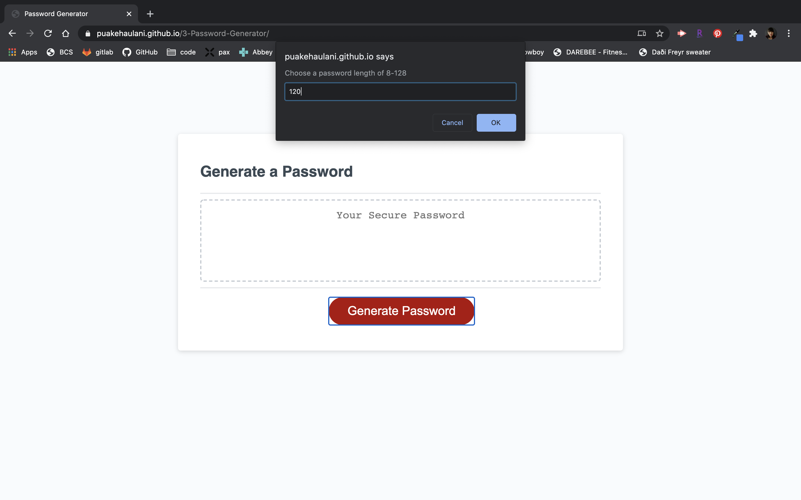
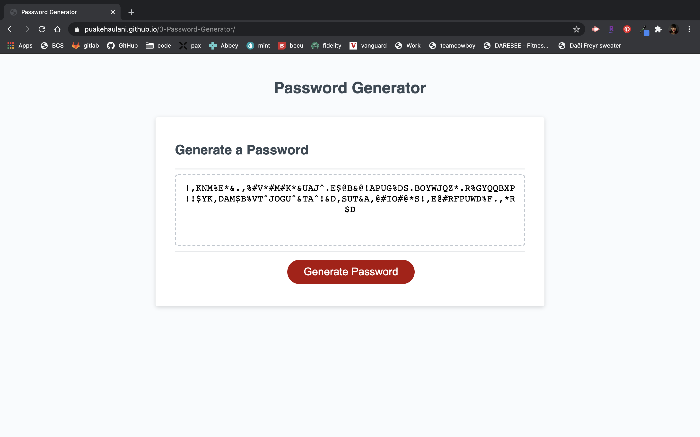

# Responsive Portfolio

[Deployed Project](https://puakehaulani.github.io/3-Password-Generator/)  
[Github Repo](https://github.com/puakehaulani/3-Password-Generator)

## About the Project

**Password Generator** is Homework 3 for UW Coding Bootcamp. We were given a [User Story](https://uwa.bootcampcontent.com/UWA-Bootcamp/uw-sea-fsf-pt-08-2020-u-c/tree/master/class-content/03-JavaScript/02-Homework#user-story) and [Acceptance Criteria](https://uwa.bootcampcontent.com/UWA-Bootcamp/uw-sea-fsf-pt-08-2020-u-c/tree/master/class-content/03-JavaScript/02-Homework#acceptance-criteria) to follow in building the functions into the generator template provided.

  


I started the assignment by pseudocoding the steps I knew I needed to hit. This pseudocoding helped to give me a place to start, and I was able to alter my comment note after each step so it became a label for what I did, so I could easily reference it later on. My focus was to first use a brute force coding solution to get the generator working, then from there enter additional functions and loops to take edge cases into account so these inputs wouldn't break the code. Finally, I identified recurring functions and attempted to simplify them into one "helper" function I could call and reuse repeatedly, which I felt in the end was more efficient.

### Built With

Javascript

## Installation

Clone the repo

```bash
git clone git@github.com:puakehaulani/3-Password-Generator.git
```

## Contributing

Pull requests are welcome. For major changes, please open an issue first to discuss what you would like to change.

## License

© 2019 Trilogy Education Services, a 2U, Inc. brand.
All Rights Reserved.

## Project Status

Currently this homework assignment is completed and submitted for grade.
